### Курс по Docker
https://www.youtube.com/watch?v=O8N1lvkIjig&t=95s

- 00:00:00 | Intro
- 00:01:35 | Основы Docker.
- 00:19:30 | Установка Docker в Linux и Windows.
- 00:25:40 | Основные команды.
- 00:54:55 | Управление портами: Port Mapping.
- 01:08:55 | Переменные в Docker: Environment Variables.
- 01:20:20 | Постоянные данные: Docker Volumes.
- 01:48:41 | Сети в Docker. Network.
- 02:30:11 | Создание своих контейнеров. Dockerfile.
- 03:40:59 | Docker Compose. Применение.
- 04:32:28 | Portainer – Web UI для управления Docker.

---

#### создать пользователя-
- `useradd -m -s /bin/bash username`

#### добавить пользователя в группу docker
- `usermod -aG docker username`
- Затем перезайти в систему или выполнить: `newgrp docker`

#### посмотреть группы пользователя
- `id username`


### Основные команды Docker

Статус докера (процесса)
````
service docker status
````
---
Тестовый образ
````
docker run hello-world
````
---
Посмотреть список контейнеров

- `docker ps`    - запущенные
- `docker ps -a` - остановленные
- `docker ps -l` - ?
---
Удалить контейнер
````
docker rm [IMAGE ID либо NAME контейнера]
````
---
Список images 
````
docker images ls
````
Удалить image
````
docker rmi [IMAGE ID]
````
---
Удалить всё!
- сначала останавливаем все контейнеры!
- `docker system prune -a --volumes`
---
- `dockler run [NAME контейнера]` - создать новый контейнер
- `dockler start [IMAGE ID либо NAME контейнера]` - запустит остановленный контейнер
---

Чтобы скачать образ нужной версии с DockerHub нежно это явно указывать:

- `docker run ubuntu:20.04` - так мы скачаем и сразу запустим образ.
- далее можно будет увидеть образ в списке `docker images`
- если при запуске образа не указывать версию, то докер сначала будет пытаться запустить `latest` версию
---

В DockerHub при выборе контейнеров есть:
- `TAG` - версия образа
- `OS/ARCH` - варианты архитектур на которые подходит образ (на обычный сервер подходит amd64, для RasberyPy - arm)
---
Паузировать контейнер
- `docker pause [CONTAINER ID либо NAME]`
- `docker ps` - смотрим STAUS, там будет Paused
- что бы снять пауза: `docker unpause [CONTAINER ID либо NAME]`
---
Остановить контейнер
- `docker stop [CONTAINER ID либо NAME]`
---
Убить процесс
- `docker kill [CONTAINER ID либо NAME]`
---
Ключи:
- `-d` - запустить контейнер в фоновом режиме (detach mode)
- `-it` - интерактивный режим
- `--rm` - после остановки контейнера он автоматически удаляется 
- `--name` - позволяет задать имя контейнеру
-  Пример: `docker run -d --rm --name My-container ubuntu:20.04`
---
Инспектировать контейнер. Это позволяет получить подробную информацию о контейнере
- `docker inspect [CONTAINER ID либо NAME]`
---
Инспекция потребления ресурсов контейнера
- `docker stats [CONTAINER ID либо NAME]`
````
CONTAINER ID   NAME            CPU %     MEM USAGE / LIMIT     MEM %     NET I/O           BLOCK I/O     PIDS
9879862b151d   project_nginx   0.00%     5.762MiB / 1.925GiB   0.29%     7.95MB / 10.4MB   32.8kB / 0B   4
````
---
Просмотр логов контейнера 
- `docker logs [CONTAINER ID либо NAME]`
- `docker logs -f [CONTAINER ID либо NAME]` - логи в режиме реального времени
---
ЗАЙТИ В КОНТЕЙНЕР!
- `docker exec -it [CONTAINER ID либо NAME] /bin/bash` 
- `docker exec -it [CONTAINER ID либо NAME] bash` - можно и так
---

### Управление портами: Port Mapping

Посмотреть все порты сервера:
- устанавливаем утилиту по инструкции, например такой: https://cloudscope.in/install-use-netstat/
- `netstat -tulpen` - список открытых портов
````
Active Internet connections (only servers)
Proto Recv-Q Send-Q Local Address           Foreign Address         State       User       Inode      PID/Program name
tcp        0      0 0.0.0.0:443             0.0.0.0:*               LISTEN      0          2275429    269399/docker-proxy
tcp        0      0 0.0.0.0:3306            0.0.0.0:*               LISTEN      0          2527133    284699/docker-proxy
tcp        0      0 0.0.0.0:80              0.0.0.0:*               LISTEN      0          2275415    269385/docker-proxy
tcp        0      0 127.0.0.53:53           0.0.0.0:*               LISTEN      101        15840      402/systemd-resolve
tcp        0      0 0.0.0.0:22              0.0.0.0:*               LISTEN      0          22901      630/sshd: /usr/sbin
tcp6       0      0 :::443                  :::*                    LISTEN      0          2275436    269407/docker-proxy
tcp6       0      0 :::3306                 :::*                    LISTEN      0          2527140    284705/docker-proxy
tcp6       0      0 :::80                   :::*                    LISTEN      0          2275422    269391/docker-proxy
tcp6       0      0 :::22                   :::*                    LISTEN      0          22903      630/sshd: /usr/sbin
udp        0      0 127.0.0.53:53           0.0.0.0:*                           101        15839      402/systemd-resolve
udp        0      0 10.129.0.7:68           0.0.0.0:*                           100        2486793    482/systemd-network

````
---
Задать порты контейнеру
- `docker run -d --name MyNginx -p 80:80 nginx`
- порт сервер 80 пробросит запрос в контейнер на порт 80
- можно пробросить несколько портов  `docker run -d --name MyNginx -p 80:80 -p 443:443 nginx`
---

## Еnvironment variables (Переменные окружения)

- `env` - посмотреть системные переменные 
- `export [VAR_NAME] = "something..."` - так можно создать переменную окружения
- ключ `-e` позволяет создать переменную в контейнере: `docker run --name DB-mysql -e MYSQL_ROOT_PASSWORD=12345qwe -e MY_VAR=test -d mysql`

#### Важно: всегда смотри документацию к контейнеру, там можно найти описание переменных окружения!!! Эти переменные нужно настраивать для корректной работы контейнера.

---

## Volumes (Постоянные данные)
Существует три варианта монтирования данных

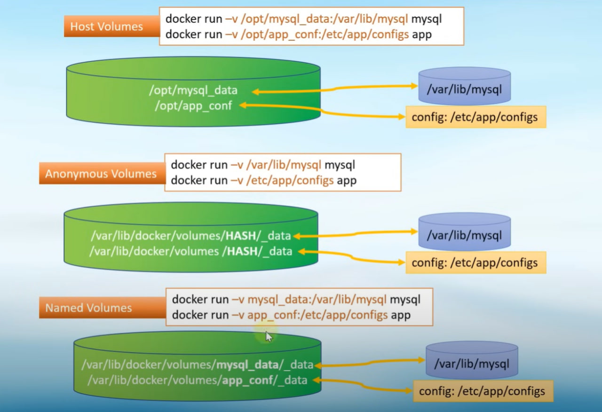

- посмотреть список Volumes: `docker volume ls`
- есть способ создать свой volume, это делается командой: `docker volume create my_volume`
- удалить volume: `docker volume rm my_volume`


---

### Docker Network (Сетевой интерфейс)
При запуске контейнера мы получаем интерфейс c 3 (тремя) типами сети (драйвера):
- "bridge" docker0: 172.17.0.0/16 (по умолчанию)
- "host" ServerIP(10.15.11.12)
- "none"

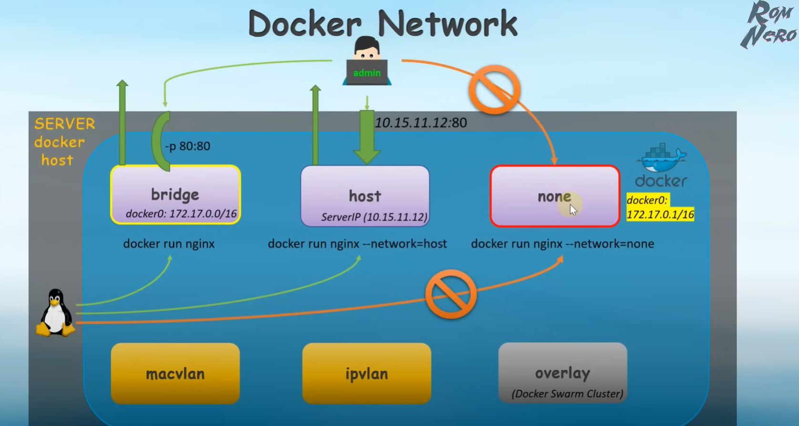

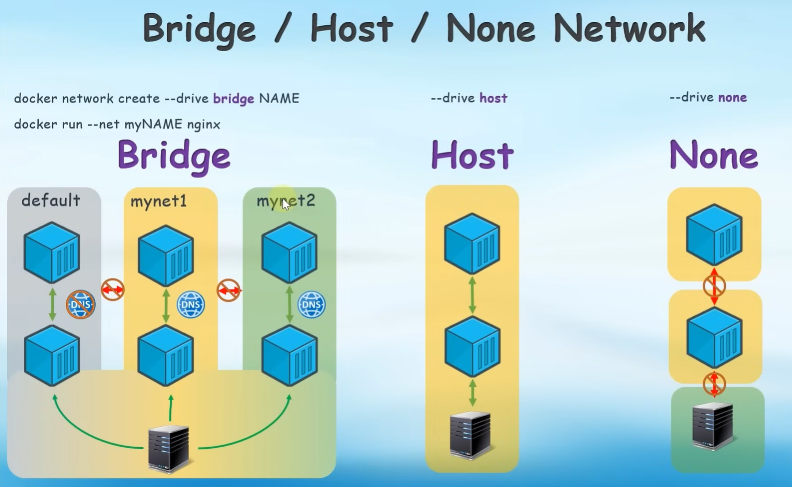

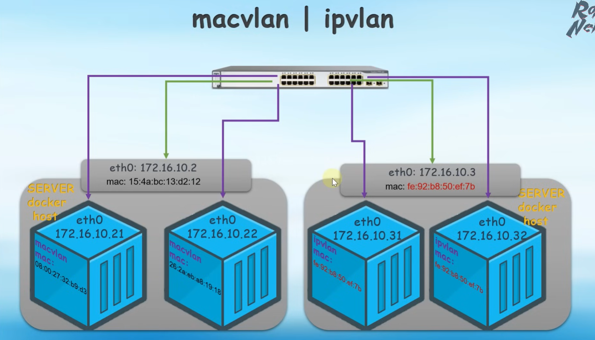

- `docker network ls` - покажет список сетей в контейнере

#### Создание своей сети

- `docker network create myNet01` - так мы создадим сеть с именем myNet01 и драйвером bridge

#### Получить информацию о сети 

- `docker network inspect myNet01`

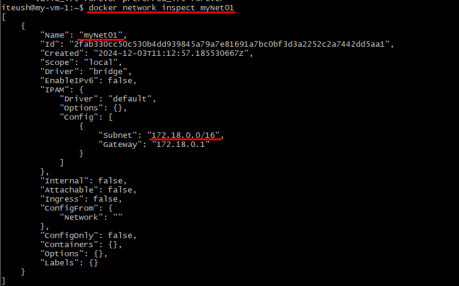

- в детализации есть IP сети (по умолчанию)

#### Задать свой IP для сети
- `docker network create -d bridge --subnet 192.168.10.0/24 --gateway 192.168.10.1 myNet192`
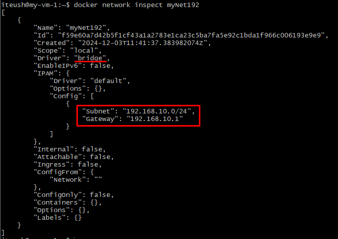

#### Удаление сетей 
- `docker network rm myNet` - указываем имя сети (в примере myNet) или id

## Создание Dockerfile
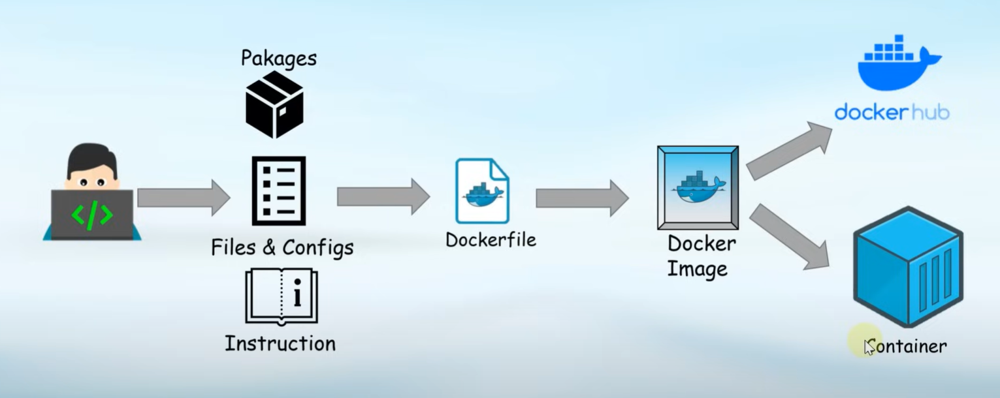

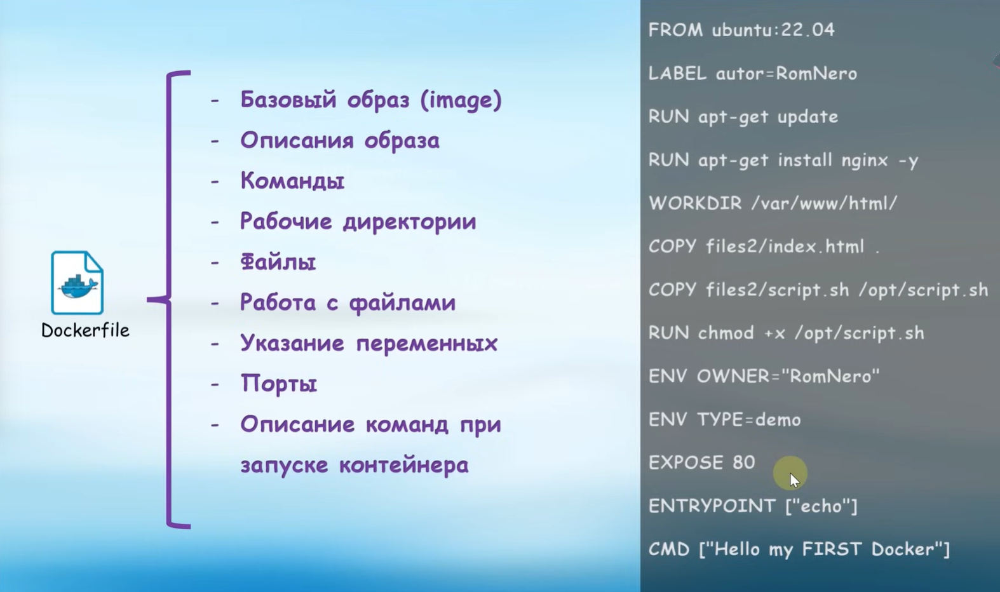

- создаем файл `touch dockerfile`
````
FROM ubuntu:22.04
CMD echo "Hello my FIRST Docker"
````
- запускаем сборку `docker build -t myimage:v01.`

- проверяем наличие нового image `docker images`
````
REPOSITORY   TAG       IMAGE ID       CREATED        SIZE
nginx        latest    66f8bdd3810c   7 days ago     192MB
<none>       <none>    e620144c88cf   2 months ago   77.9MB
````
- присваиваем TAG `docker tag e620144c88cf mydocker:v01` 
````
REPOSITORY   TAG       IMAGE ID       CREATED        SIZE
nginx        latest    66f8bdd3810c   7 days ago     192MB
mydocker     v01       e620144c88cf   2 months ago   77.9MB
````
- теперь запустим наш новый образ:
````
docker run --rm --name mydocker mydocker:v01
````
- Результат: `Hello my FIRST Docker`

#### Запустить контейнер и войти в него
- `docker run -it --rm --name mydocker myimage:v01 /bin/bash`

#### Нюансы
- `CMD`  - эти команды можно изменять 
- `ENTRYPOINT`  - фиксированная команда (это изменять не можем)
- для запуска команды нужно писать в dockerfile так: `CMD ["echo", "Hello my FIRST Docker"]`
- далее собираем образ: `docker build -t myimage:v03`
- и запускаем образ: `docker run --rm --name mydocker myimage:v03`

#### Инспектирование образа
````
docker images inspect <id или имя образа>
````

#### Добавим в наш образ Nginx

```` dockerfile
FROM ubuntu:22.04
LABLE autor=iteush
RUN apt-get update
RUN apt-get install nginx -y
CMD echo "Hello my FIRST Docker"
````
 - ключ `-y` разрешает установку без подтверждения действий!!!

- Чтобы запустить nginx, нужно в dockerfile указать команду, предписанную документацией:
````dockerfile
CMD ["nginx","-g","daemon off;"]
````
- теперь dockerfile будет выглядеть так:
``` dockerfile
FROM ubuntu:22.04
LABLE autor=iteush
RUN apt-get update
RUN apt-get install nginx -y
CMD ["nginx","-g","daemon off;"]
````
- соберем новый образ 
````
docker build -t myimage-nginx:v01 .
````
- `-t` - говорит о том, что мы хотим присвоить имя образу
- `myimage-nginx:v01` - это имя и тег (версия) которые мы хотим присвоить образу  
- запустим 
````
docker run -d --rm --name mydocker myimage-nginx:v01
````
- подключимся к контейнеру и посмотри что в нем работает 
````
docker exec -it mydocker /bin/bash
ps xa
````
- команда `ps xa` покажет что работает в контейнере
````bash
root@4cf023f45389:/# ps xa
    PID TTY      STAT   TIME COMMAND
      1 ?        Ss     0:00 nginx: master process nginx -g daemon off;
      7 ?        S      0:00 nginx: worker process
      8 ?        S      0:00 nginx: worker process
      9 pts/0    Ss     0:00 /bin/bash
     20 pts/0    R+     0:00 ps xa
````
- мы видим что в контейнере запущен nginx, но без портов, что не позволит нам достучаться до контейнера. Исправим это!

````bash
docker run -d --rm --name mydocker -p80:80 test:v01
````
- можно задать порт прямо в dockerfile, используя параметр EXPOSE 

```dockerfile
FROM ubuntu:22.04
LABEL autor=iteush
RUN apt-get update
RUN apt-get install nginx -y
EXPOSE 80
EXPOSE 443/tcp
CMD ["nginx","-g","daemon off;"]

```
- так будут открыты два порта в контейнере 80 и 443 (это внутренние порты контейнера)
- теперь пробросим внешние, для этого добавим ключ `-P`
```
docker run -d --rm --name mydocker -P mydockerx:v02
```
````
iteush@my-vm-1:~/docker$ docker run -d --rm --name mydocker -P  mydockerx:v02
79a5efa23dd69e3ce46cb782a30fc75834f6594b4f5d9524460d840b5d51bf62
iteush@my-vm-1:~/docker$ docker ps
CONTAINER ID   IMAGE           COMMAND                  CREATED          STATUS          PORTS                                                                                    NAMES
79a5efa23dd6   mydockerx:v02   "nginx -g 'daemon of…"   16 seconds ago   Up 15 seconds   0.0.0.0:32768->80/tcp, [::]:32768->80/tcp, 0.0.0.0:32769->443/tcp, [::]:32769->443/tcp   mydocker
````
- внешние порты проброшены! но они выбраны случайным образом

# Docker Compose
- Пример переноса команды для запуска контейнера из командной строки в docker-compose.yml
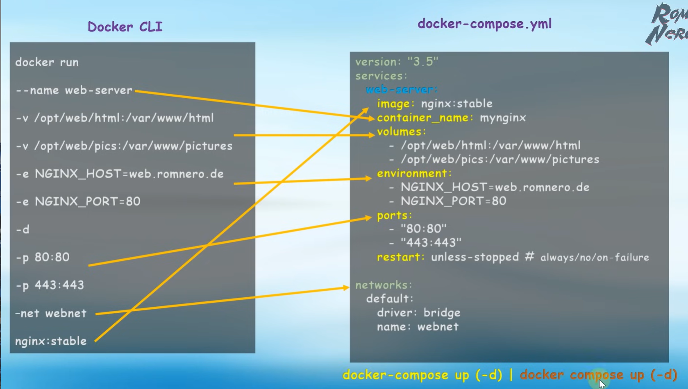

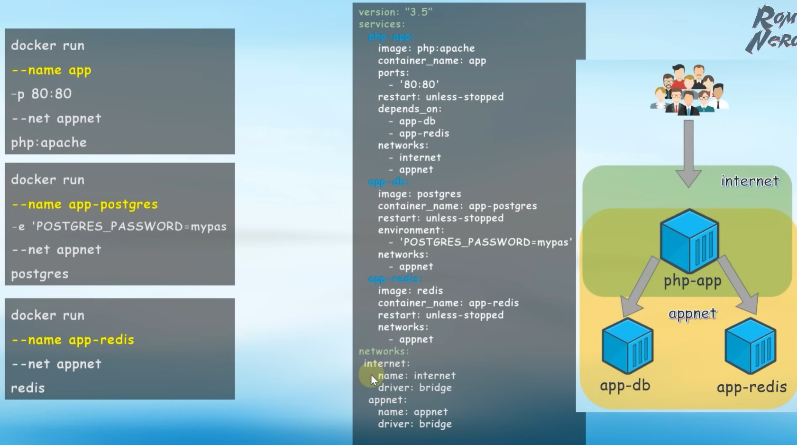

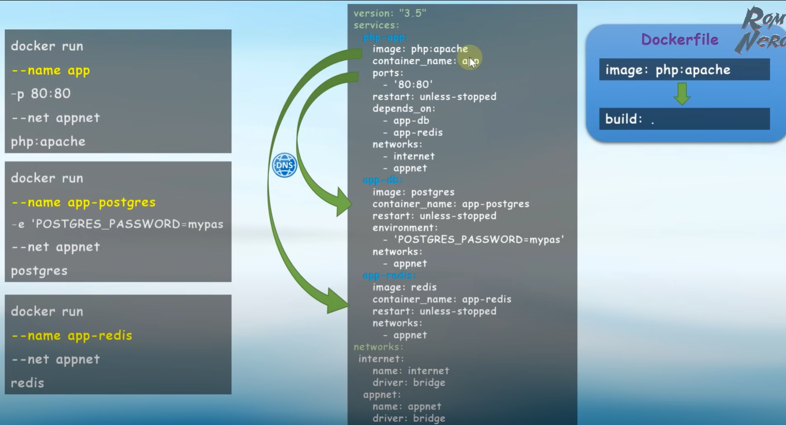

- `` - 
- `docker compose up -d` - запустить файл docker-compose.yml в (детеч режиме)
- `docker compose logs -f` - просмотр логов в запущенном контейнере 
- `docker compose stop` - остановит контейнер созданный в этом каталоге 


# Portainer (управление контейнерами)
- установка
  https://docs.portainer.io/start/install-ce/server/docker/linux

### Steps
- переходим в каталог `cd /opt`
- создаем каталог `mkdir portainer`
- переходим в каталог и добавляем volume:
```bash
docker volume create portainer_data
```
- создаем `dicker-compose.yml` файл со следующим содержимым:
```bash
services:
  portainer:
    image: portainer/portainer-ce:2.21.4
    container_name: portainer
  environment:
    - TZ=Europe/Moscow
  volumes:
    - /var/run/docker.sock:/var/run/docker.sock
    - /opt/portainer/portainer_data:/data
  ports:
    - "8000:8000"
    - "9443:9443"
  restart: always
``` 
- запускаем сборку `docker compose up -d`

- переходим `https://localhost:9443`