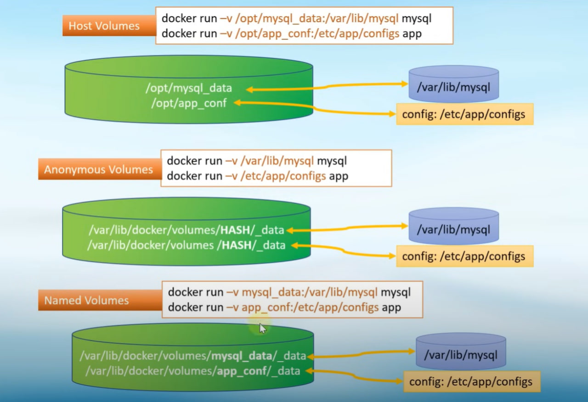

### Курс по Docker
https://www.youtube.com/watch?v=O8N1lvkIjig&t=95s

00:00:00 | Intro
00:01:35 | Основы Docker.
00:19:30 | Установка Docker в Linux и Windows.
00:25:40 | Основные команды.
00:54:55 | Управление портами: Port Mapping.
01:08:55 | Переменные в Docker: Environment Variables.
01:20:20 | Постоянные данные: Docker Volumes.
01:48:41 | Сети в Docker. Network.
02:30:11 | Создание своих контейнеров. Dockerfile.
03:40:59 | Docker Compose. Применение.
04:32:28 | Portainer – Web UI для управления Docker.

---

#### создать пользователя-
- `useradd -m -s /bin/bash username`

#### добавить пользователя в группу docker
- `usermo -aG docker username`

#### посмотреть группы пользователя
- `id username`


### Основные команды Docker

Статус докера (процесса)
````
service docker status
````
---
Тестовый образ
````
docker run hello-world
````
---
Посмотреть список контейнеров

- `docker ps`    - запущенные
- `docker ps -a` - остановленные
- `docker ps -l` - ?
---
Удалить контейнер
````
docker rm [IMAGE ID либо NAME контейнера]
````
---
Список images 
````
docker images
````
Удалить image
````
docker rmi [IMAGE ID]
````
---
Удалить всё!
- сначала останавливаем все контейнеры!
- `docker system prune -a --volumes`
---
- `dockler run [NAME контейнера]` - создать новый контейнер
- `dockler start [IMAGE ID либо NAME контейнера]` - запустит остановленный контейнер
---

Чтобы скачать образ нужной версии с DockerHub нежно это явно указывать:

- `docker run ubuntu:20.04` - так мы скачаем и сразу запустим образ.
- далее можно будет увидеть образ в списке `docker images`
- если при запуске образа не указывать версию, то докер сначала будет пытаться запустить `latest` версию
---

В DockerHub при выборе контейнеров есть:
- `TAG` - версия образа
- `OS/ARCH` - варианты архитектур на которые подходит образ (на обычный сервер подходит amd64, для RasberyPy - arm)
---
Паузировать контейнер
- `docker pause [CONTAINER ID либо NAME]`
- `docker ps` - смотрим STAUS, там будет Paused
- что бы снять пауза: `docker unpause [CONTAINER ID либо NAME]`
---
Остановить контейнер
- `docker stop [CONTAINER ID либо NAME]`
---
Убить процесс
- `docker kill [CONTAINER ID либо NAME]`
---
Ключи:
- `-d`   - запустить контейнер в фоновом режиме (detach mode)
- `--rm` - после остановки контейнера он автоматически удаляется 
- `--name` - позволяет задать имя контейнеру
-  Пример: `docker run -d --rm --name My-container ubuntu:20.04`
---
Инспектировать контейнер. Это позволяет получить подробную информацию о контейнере
- `docker inspect [CONTAINER ID либо NAME]`
---
Инспекция потребления ресурсов контейнера
- `docker stats [CONTAINER ID либо NAME]`
````
CONTAINER ID   NAME            CPU %     MEM USAGE / LIMIT     MEM %     NET I/O           BLOCK I/O     PIDS
9879862b151d   project_nginx   0.00%     5.762MiB / 1.925GiB   0.29%     7.95MB / 10.4MB   32.8kB / 0B   4
````
---
Просмотр логов контейнера 
- `docker logs [CONTAINER ID либо NAME]`
- `docker logs -f [CONTAINER ID либо NAME]` - логи в режиме реального времени
---
ЗАЙТИ В КОНТЕЙНЕР!
- `docker exec -it [CONTAINER ID либо NAME] /bin/bash` 
- `docker exec -it [CONTAINER ID либо NAME] bash` - можно и так
---

### Управление портами: Port Mapping

Посмотреть все порты сервера:
- станавливаем утилиту по инструкции, например такой: https://cloudscope.in/install-use-netstat/
- `netstat -tulpen` - список открытых портов
````
Active Internet connections (only servers)
Proto Recv-Q Send-Q Local Address           Foreign Address         State       User       Inode      PID/Program name
tcp        0      0 0.0.0.0:443             0.0.0.0:*               LISTEN      0          2275429    269399/docker-proxy
tcp        0      0 0.0.0.0:3306            0.0.0.0:*               LISTEN      0          2527133    284699/docker-proxy
tcp        0      0 0.0.0.0:80              0.0.0.0:*               LISTEN      0          2275415    269385/docker-proxy
tcp        0      0 127.0.0.53:53           0.0.0.0:*               LISTEN      101        15840      402/systemd-resolve
tcp        0      0 0.0.0.0:22              0.0.0.0:*               LISTEN      0          22901      630/sshd: /usr/sbin
tcp6       0      0 :::443                  :::*                    LISTEN      0          2275436    269407/docker-proxy
tcp6       0      0 :::3306                 :::*                    LISTEN      0          2527140    284705/docker-proxy
tcp6       0      0 :::80                   :::*                    LISTEN      0          2275422    269391/docker-proxy
tcp6       0      0 :::22                   :::*                    LISTEN      0          22903      630/sshd: /usr/sbin
udp        0      0 127.0.0.53:53           0.0.0.0:*                           101        15839      402/systemd-resolve
udp        0      0 10.129.0.7:68           0.0.0.0:*                           100        2486793    482/systemd-network

````
---
Задать порты контейнеру
- `docker run -d --name MyNginx -p 80:80 nginx`
- порт сервер 80 пробросит запрос в контейнер на порт 80
- можно пробросить несколько портов  `docker run -d --name MyNginx -p 80:80 -p 443:443 nginx`
---

## Еnvironment variables (Переменные окружения)

- `env` - посмотреть системные переменные 
- `export [VAR_NAME] = "something..."` - так можно создать переменную окружения
- ключ `-e` позволяет создать переменную в контейнере: `docker run --name DB-mysql -e MYSQL_ROOT_PASSWORD=12345qwe -e MY_VAR=test -d mysql`

#### Важно: всегда смотри документацию к контейнеру, там можно найти описание переменных окружения!!! Эти переменные нужно настраивать для корректной работы контейнера.

---

## Volumes (Постоянные данные)
Существует три варианта монтирования данных

